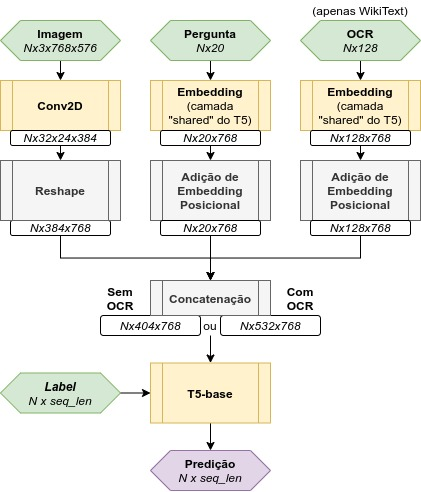

# IA376J - Final Project

In this class we aimed to apply deep learning techniques in both vision and natural language processing tasks. Ultimately, our goal was to perform Visual Question Answering tasks with images that contained text and non-text features. Our final task was with the DocVQA dataset.

## Approach

We used mainly a T5 model during the whole class. Below is the architecture I tried with the experiments in this repo. I wanted to do an end2end solution to the problem with most of my efforts aimed at the pre-training stage. Therefore the models are almost identical on all experiments and the changes are done mostly to the dataset and to a few hyperparameters.

There were two pre-training tracks:
1) SQuAD 2.0

	1.1) OCR Task
	
	1.2) VQA Task with original questions/answers from the dataset
	

2) WikiText synthetic MLM and VQA task.

## Results

None of these experiments worked as of now. The SQuAD 2.0 OCR task resulted in a maximum 20% F1 score, while all other tasks got a maximum of 1.8%. There is probably something wrong with the WikiText track because the loss is not decreasing nicely, it may have to do with the dataset which is heavely synthetic or with the OCR addition to the model's forward pass.
